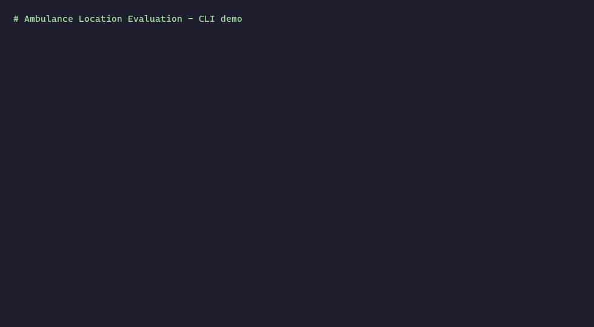

# Ambulance Location Evaluation — Patras

[](https://www.python.org/)
[](#setup)

[](LICENSE)


Evaluating the existing ambulance station layout in the Municipality of Patras (Greece) using the **Double Standard Model (DSM)** of Gendreau, Laporte and Semet (1997). The model is solved as a mixed-integer program with [`pymprog`](https://pypi.org/project/pymprog/) (GLPK backend).

<p align="center">
  
</p>

---

## Table of contents
- [Background](#background)
- [The model](#the-model)
- [Case study](#case-study)
- [Setup](#setup)
- [Usage](#usage)
- [Tests](#tests)
- [Results](#results)
- [Project layout](#project-layout)
- [References](#references)

---

## Background

USEMSA (United States Emergency Medical Services Act) sets two coverage standards:

| Area  | Standard                                       |
| ----- | ---------------------------------------------- |
| Urban | 95% of incidents handled within **10 minutes** |
| Rural | 95% of incidents handled within **35 minutes** |

For **heart-attack** cases the critical response time is **8 minutes**; every additional minute reduces the survival rate by 7–10%.

---

## The model

Gendreau's DSM uses two response-time thresholds `rt1 < rt2`:

- All demand must be reachable within `rt2`.
- A fraction `λ` of demand must be reachable within `rt1`.
- The objective **maximises weighted double-coverage within `rt1`**.

### Parameters

| Symbol     | Meaning                                              |
| ---------- | ---------------------------------------------------- |
| `d[i]`     | Emergency-call weight at point `i`                   |
| `t[j][i]`  | Travel time from station `j` to point `i`            |
| `a[j][i]`  | 1 if `t[j][i] ≤ rt1`, else 0                         |
| `b[j][i]`  | 1 if `t[j][i] ≤ rt2`, else 0                         |
| `P`        | Total fleet budget                                   |
| `Pj`       | Per-station ambulance cap                            |
| `λ`        | Required single-coverage fraction within `rt1`       |

### Decision variables

| Symbol  | Kind    | Meaning                                                  |
| ------- | ------- | -------------------------------------------------------- |
| `x1[i]` | Binary  | Point `i` is covered at least **once** within `rt1`      |
| `x2[i]` | Binary  | Point `i` is covered at least **twice** within `rt1`     |
| `y[j]`  | Integer | Number of ambulances at station `j`                      |

### Objective

```
maximise  Σ  d[i] · x2[i]
          i
```

The constraints (R1–R5) are documented inline in [`dsm.py`](dsm.py).

---

## Case study

| Property              | Value         |
| --------------------- | ------------- |
| Area                  | 125.4 km²     |
| Residents (2011)      | 170,896       |
| Density               | 1,363 / km²   |


12 points of interest (black) and 4 stations / hospitals:


Total weighted demand sums to **125**, which is the theoretical maximum of the objective.

| Case | Stations                                                    | Ambulances | `rt2`  |
| ---- | ----------------------------------------------------------- | ---------- | ------ |
| 1    | Agios Andreas, University Hospital, Port                    | 10         | 18 min |
| 2    | Case 1 + Pampeloponnisiako                                  | 24         | 16 min |

`rt2` is derived automatically as the worst best-case travel time: `max_i ( min_j t[j][i] )`.

---

## Setup

Requires **Python 3.10+** (tested on 3.12). Runs on **Windows, macOS, and Linux** — `pymprog` and its `swiglpk` backend ship prebuilt wheels for all three.

```bash
pip install -r requirements.txt
```

For tests: `pip install -r requirements-dev.txt`.

---

## Usage

A unified CLI (`run.py`) reproduces any of the four headline results without editing source:

```bash
python run.py --case 1 --rt1 10    # 88.8% double coverage
python run.py --case 1 --rt1 8     # 42.4%
python run.py --case 2 --rt1 10    # 91.2%
python run.py --case 2 --rt1 8     # 62.4%
```

| Flag         | Description                                                     | Default                  |
| ------------ | --------------------------------------------------------------- | ------------------------ |
| `--case`     | `1` (3 stations) or `2` (4 stations). **Required.**             | —                        |
| `--rt1`      | Primary response-time threshold (minutes).                      | 8                        |
| `--lamda`    | Required single-coverage fraction within `rt1`.                 | 0.42 (case 1) / 0.6 (case 2) |
| `--verbose`  | Print pymprog solver progress.                                  | off                      |

The legacy entry points still work standalone:

```bash
python case1.py
python case2.py
```

---

## Tests

```bash
pytest tests/
```

Smoke tests pin all four headline numbers and the derived `rt2` for both cases.

---

## Results

### Case 1 — 3 stations, 10 ambulances, `rt2 = 18 min`

| `rt1`  | Objective  | Double coverage |
| ------ | ---------- | --------------- |
| 10 min | 111 / 125  | **88.8%**       |
| 8 min  | 53 / 125   | **42.4%**       |

Minimum ambulances needed to reach the optimal objective: **5**.


### Case 2 — 4 stations, 24 ambulances, `rt2 = 16 min`

| `rt1`  | Objective  | Double coverage |
| ------ | ---------- | --------------- |
| 10 min | 114 / 125  | **91.2%**       |
| 8 min  | 78 / 125   | **62.4%**       |

Minimum ambulances needed to reach the optimal objective: **6**.


### Takeaway

Adding the 4th station (Pampeloponnisiako) and increasing the fleet:

- **At the USEMSA `rt1 = 10 min` standard** — coverage improves marginally: 88.8% → 91.2%.
- **At the heart-attack-critical `rt1 = 8 min` threshold** — coverage improves substantially: 42.4% → 62.4%.

The marginal gain at the USEMSA standard is small because the 3-station layout was already close to saturation there; the gap was in faster (`rt1 = 8 min`) coverage, where the new station has the largest effect.

---

## Project layout

```
.
├── dsm.py              # DSM solver (solve_dsm, derive_rt2, format_report)
├── case1.py            # Case 1 data + thin entry point
├── case2.py            # Case 2 data + thin entry point
├── run.py              # Unified CLI
├── tests/
│   └── test_dsm.py     # Smoke tests pinning README numbers
├── docs/
│   ├── usage.gif          # CLI demo (shown above)
│   └── generate_demo.py   # Regenerator: `python docs/generate_demo.py`
├── requirements.txt
├── requirements-dev.txt
└── README.md
```

---

## References

- Gendreau, M., Laporte, G., & Semet, F. (1997). *Solving an ambulance location model by tabu search.* Location Science, 5(2), 75–88.

---

## License

See [LICENSE](LICENSE).
